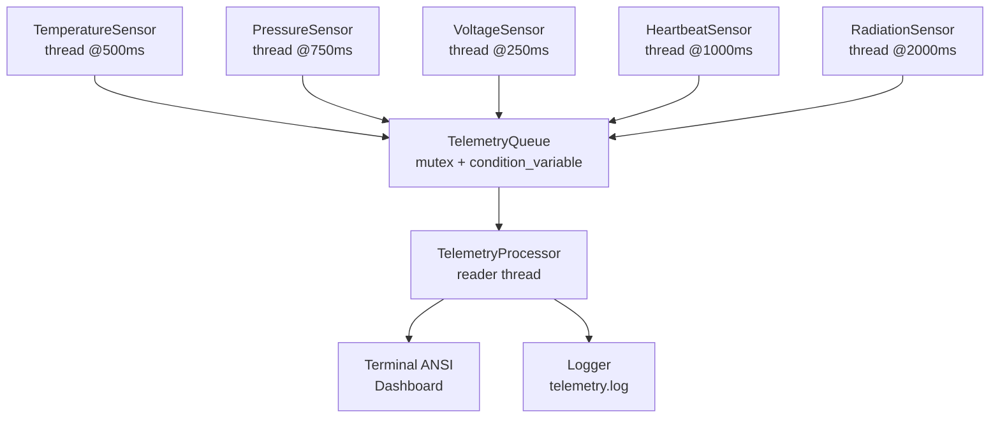
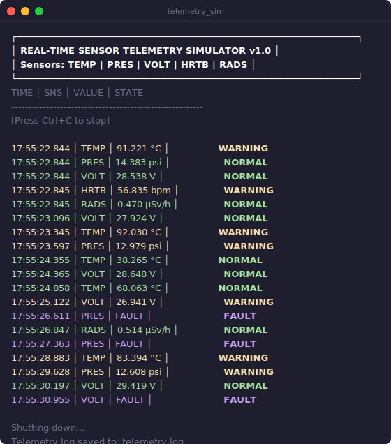

# Real-Time Sensor Telemetry Simulator

A multithreaded C++17 application that simulates spacecraft sensors, streams live telemetry to a color-coded terminal dashboard, and logs all events to a file. Built to demonstrate systems-level engineering skills relevant to simulation and spacecraft-support work (METECS portfolio project).

---

## Features

| Feature | Details |
|---|---|
| **5 sensors** | Temperature, Pressure, Voltage, Heartbeat, Radiation |
| **Multithreaded** | One `std::thread` per sensor, independent publish rates |
| **Shared queue** | Thread-safe `TelemetryQueue` using `mutex` + `condition_variable` |
| **Fault injection** | ~5% random faults per sensor (missing/invalid data) |
| **ANSI dashboard** | Color-coded alarm states: green=NORMAL, yellow=WARNING, red=CRITICAL, magenta=FAULT |
| **File logging** | All readings appended to `telemetry.log` with timestamps |
| **Unit tests** | GoogleTest coverage for alarm thresholds and queue behavior |
| **CMake build** | Clean CMake project with static library + test target |

---

## Architecture



---

## Sensors & Alarm Thresholds

| Sensor | Unit | Interval | NORMAL | WARNING | CRITICAL |
|---|---|---|---|---|---|
| TEMP (Temperature) | °C | 500 ms | < 75 | 75–95 | ≥ 95 |
| PRES (Pressure) | psi | 750 ms | 13.5–15.5 | 12–13.5 / 15.5–17 | < 12 or > 17 |
| VOLT (Voltage) | V | 250 ms | 27–33 | 25–27 / 33–35 | < 25 or > 35 |
| HRTB (Heartbeat) | bpm | 1000 ms | 60–100 | 50–60 / 100–110 | < 50 or > 110 |
| RADS (Radiation) | μSv/h | 2000 ms | < 5 | 5–10 | ≥ 10 |

---

## Build

### Prerequisites

- GCC ≥ 9 or Clang ≥ 10 (C++17 support)
- CMake ≥ 3.16
- Linux (or macOS for local dev)
- Optional: GoogleTest (`sudo apt install libgtest-dev` / `brew install googletest`)

### Quick start

```bash
# Clone and enter the project
git clone <repo-url>
cd Real-Time-Sensor-Telemetry-Simulator

# Build only
./scripts/build_run.sh

# Build and run (Ctrl+C to stop)
./scripts/build_run.sh --run

# Build, test, and run for 30 seconds
./scripts/build_run.sh --test --run 30

# Clean rebuild
./scripts/build_run.sh --clean --run
```

### Manual CMake

```bash
cmake -S . -B build -DCMAKE_BUILD_TYPE=Release
cmake --build build --parallel
./build/telemetry_sim          # run until Ctrl+C
./build/telemetry_sim 30       # run for 30 seconds
./build/run_tests              # unit tests (if GTest installed)
```

---

## Demo



---

## Project Structure

```
Real-Time-Sensor-Telemetry-Simulator/
├── CMakeLists.txt
├── README.md
├── include/
│   ├── SensorReading.h        # Data structs + AlarmState enum
│   ├── TelemetryQueue.h       # Thread-safe queue interface
│   ├── Sensor.h               # Abstract sensor base class
│   ├── TemperatureSensor.h
│   ├── PressureSensor.h
│   ├── VoltageSensor.h
│   ├── HeartbeatSensor.h
│   ├── RadiationSensor.h
│   ├── TelemetryProcessor.h   # Queue consumer + terminal display
│   └── Logger.h               # File logger
├── src/
│   ├── main.cpp
│   ├── Sensor.cpp
│   ├── TelemetryQueue.cpp
│   ├── Logger.cpp
│   ├── TelemetryProcessor.cpp
│   ├── TemperatureSensor.cpp
│   ├── PressureSensor.cpp
│   ├── VoltageSensor.cpp
│   ├── HeartbeatSensor.cpp
│   └── RadiationSensor.cpp
├── tests/
│   └── test_sensors.cpp       # GoogleTest unit tests
└── scripts/
    └── build_run.sh           # Build/run/test automation
```

---

## Why this project

Demonstrates spacecraft-support engineering skills:
- **Concurrent systems**: independent sensor threads, race-condition-free queue
- **Real-time data processing**: producer/consumer pattern with condition variables
- **Fault simulation**: randomized fault injection for testing alarm logic
- **Observability**: structured logging for post-run analysis
- **Build hygiene**: CMake static library, separate test target, CI-ready
